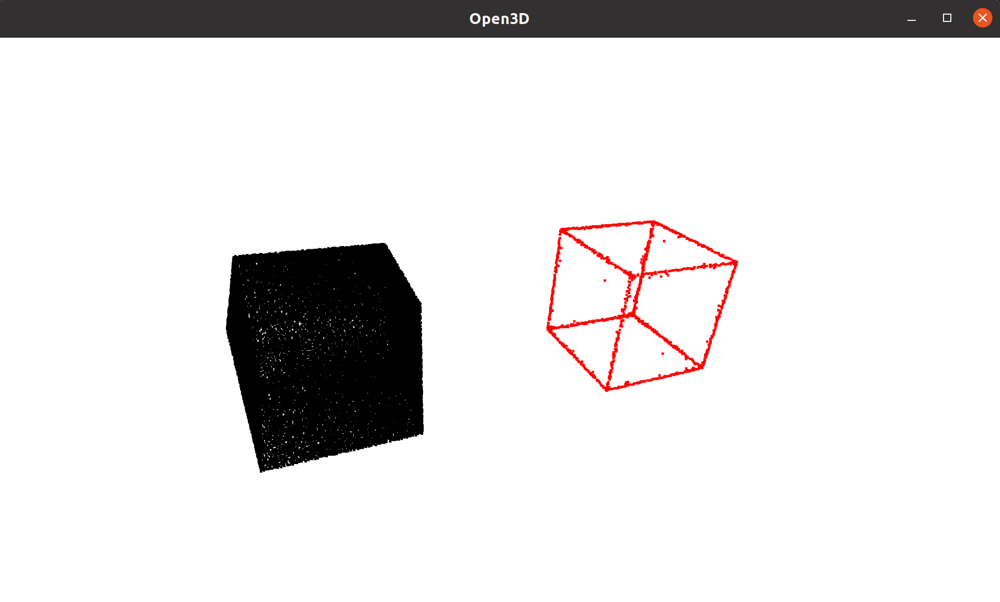
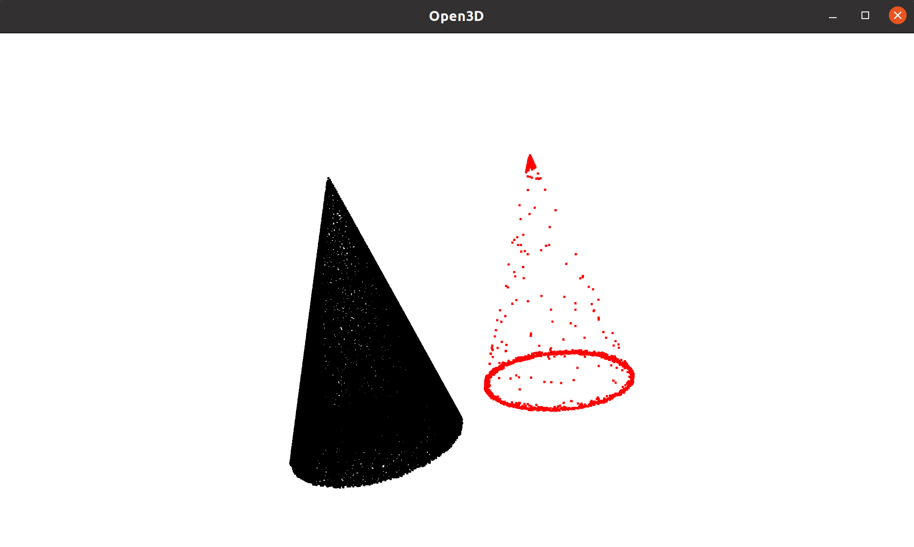

# A python implement of fast resampling of 3d point clouds via graphs

[Fast Resampling of Three-Dimensional Point Clouds via Graphs](https://ieeexplore.ieee.org/abstract/document/8101025). 

## Dependency
open3d

numpy

spicy

## Usage

```
python main.py
```

You could edit point cloud file, all parameters in the main.py. 

Only high pass and all pass filters are implemented.

high pass filter can extract edge/corner from unorder point cloud. But my code now only works for uniformly distributed point cloud.

## Result





## Acknowledge

This repo heavily depends on [fast_point_cloud_sampling](https://github.com/pmkalshetti/fast_point_cloud_sampling). I replace the cpp code with python.


## Reference
    @article{chen2017fast,
    title={Fast resampling of three-dimensional point clouds via graphs},
    author={Chen, Siheng and Tian, Dong and Feng, Chen and Vetro, Anthony and Kova{\v{c}}evi{\'c}, Jelena},
    journal={IEEE Transactions on Signal Processing},
    volume={66},
    number={3},
    pages={666--681},
    year={2017},
    publisher={IEEE}
    }